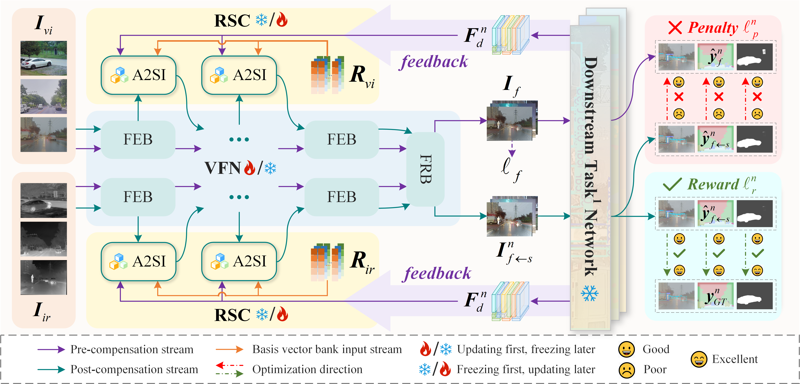

# CLDyN

### CLDyN: A Closed-Loop Dynamic Network for Adaptive Multi-Task-Aware Infrared-Visible Image Fusion [CVPR 2026]
By Zengyi Yang; Yu Liu*; Juan Cheng; Zhiqin Zhu; Yafei Zhang; Huafeng Li*

## Recommended Environment 
The recommended environment to run the code:
 - [ ] python = 3.9.0
 - [ ] torch = 2.3.0
 - [ ] torchvision = 0.18.0
 - [ ] cuda = 11.8
 - [ ] timm = 0.9.12
 - [ ] numpy = 1.24.3
 - [ ] scipy = 1.13.1
 - [ ] pillow = 10.3.0
 - [ ] tensorboardX = 2.6.2.2
 - [ ] opencv-python = 4.9.0.80
 - [ ] mmcv = 2.2.0
 - [ ] kornia = 0.5.11
 

## Getting Started
### To Test:
* To obtain the visually guided fused images

        python test_VFN.py

* To obtain the multi-task adaptive fused images

        python test_RSC.py

### To Train:
* Train VFN
    * Prepare training data:

            Dataset name
            ├── train               # Training data
            │   ├── vis             # Visible images
            │   │   ├── ***.png
            │   │   └── ...
            │   ├── ir              # Infrared images
            │   │   ├── ***.png
            │   │   └── ...
            ├── test                # Testing data
            │   ├── vis             # Visible images
            │   │   ├── ***.png
            │   │   └── ...
            │   ├── ir              # Infrared images
            │   │   ├── ***.png
            │   │   └── ...
    * Run:

          python train_VFN.py

* Train RSC
    * Prepare training data:
      * Object Detection Dataset (M3FD):

             M3FD_Detection
             ├── ir               
             │   ├── train          
             │   │   ├── ***.png
             │   │   └── ...
             │   ├── test           
             │   │   ├── ***.png
             │   │   └── ...
             ├── vi                
             │   ├── train              
             │   │   ├── ***.png
             │   │   └── ...
             │   ├── test              
             │   │   ├── ***.png
             │   │   └── ...
             ├── labels                
             │   ├── train             
             │   │   ├── ***.txt
             │   │   └── ...
             │   ├── test              
             │   │   ├── ***.txt
             │   │   └── ...
      * Semantic Segmentation Dataset (FMB):
      
             FMB
             ├── train               
             │   ├── Infrared             
             │   │   ├── ***.png
             │   │   └── ...
             │   ├── Visible              
             │   │   ├── ***.png
             │   │   └── ...
             │   ├── Label              
             │   │   ├── ***.png
             │   │   └── ... 
             ├── test                
             │   ├── Infrared             
             │   │   ├── ***.png
             │   │   └── ...
             │   ├── Visible              
             │   │   ├── ***.png
             │   │   └── ...
             │   ├── Label              
             │   │   ├── ***.png
             │   │   └── ...

      * Salient Object Detection Dataset (VT5000):

             VT5000
             ├── Train               
             │   ├── T_GRAY             
             │   │   ├── ***.png
             │   │   └── ...
             │   ├── RGB              
             │   │   ├── ***.png
             │   │   └── ...
             │   ├── GT              
             │   │   ├── ***.png
             │   │   └── ... 
             │   ├── Edge              
             │   │   ├── ***.png
             │   │   └── ...
             ├── Test                
             │   ├── T_GRAY             
             │   │   ├── ***.png
             │   │   └── ...
             │   ├── RGB              
             │   │   ├── ***.png
             │   │   └── ...
             │   ├── GT              
             │   │   ├── ***.png
             │   │   └── ... 

  * Prepare the code for downstream task networks:
    * The object detection network adopts YOLO:
 
           CLDyN
           └── yolo              
               └── ...             
    * The semantic segmentation network adopts SegFormer:
       
           CLDyN
           └── segformer               
               └── ...             
    * The salient object detection network adopts CTDNet:
       
           CLDyN
           └── ctdnet               
               └── ...             
  * Run:

        python train_RSC.py

## Pretrained Model
*   The code and pre-trained model will be released upon paper acceptance.
